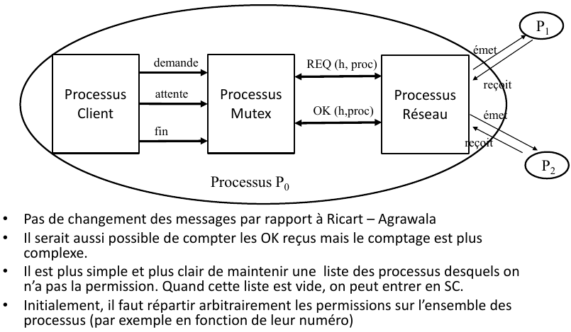

# PRR - Laboratoire 2 : Exclusion mutuelle

_Algorithme de Carvalho-Roucairol_

_Auteurs : Jael Dubey et Luc Wachter_

## Description

Ce laboratoire a pour but l'implémentation de l'algorithme de Carvalho-Roucairol afin de mettre en place
l'exclusion mutuelle sur une simple variable partagée.

Le logiciel, une fois lancé en autant de processus que précisé dans le fichier de configuration, s'assure
que tous les processus ont été lancés, puis propose une invite de commande à l'utilisateur. Celui-ci peut alors
utiliser les commandes décrites pour lire la valeur partagée ou la modifier. S'il la modifie, l'algorithme d'acquisition
de section critique est exécuté, puis la nouvelle valeur est distribuée aux autres processus, avant de relâcher
la section critique.

## Utilisation

### Ajustement des paramètres dans le fichier

1. Ouvrir le fichier `main/parameters.json`.
2. Adapter les valeurs pour le port initial, l'adresse IP et le nombre de processus.

### Lancer les processus

1. Se positionner dans le dossier `PRR-Lab2/` (à la racine des packages).
2. Ouvrir autant de terminaux que précisé dans le fichier de paramètres.
3. Lancer dans chaque terminal le programme, en précisant l'id du processus : `go run main/main.go 0`.
4. `go run main/main.go 1`, etc.

---

- Le programme attend alors que tous les processus soient lancés.
- Il est alors possible d'effectuer les commandes proposées à l'utilisateur.

## Implémentation

Pour écrire le programme, nous nous sommes basés sur la structure proposée dans la slide 21 du ch. 3.3 du cours (ci-dessous).

Nous avons donc séparé au mieux les couches "Client", "Mutex" et "Network".

### Packages et fichiers

- Le package `main` contient le point d'entrée principal du programme. Il lance le serveur TCP dans une go routine afin d'écouter les connections entrantes, puis lance le processus client dans une autre go routine (en leur passant à chacun les channels nécessaires à la communication inter-processus.)
- Le package `client` contient la partie visible par l'utilisateur : l'interface dans le terminal. Il communique avec le package `main` pour gérer la section critique.
- Le package `mutex` contient l'implémentation de l'algorithme de Carvalho et Roucairol. Ses fonctions sont appelées par le package `main` pour gérer la section critique.
- Le package `network` contient les fichiers suivants.
    - Le fichier `protocol.go` contient les types utilisés pour la communication réseau ainsi que des valeurs importantes et les fonctions d'encodage en bytes et de décodage.
    - Le fichier `connection.go` contient le serveur de réception TCP et la fonction d'envoi de requêtes.

### Simplifications

Afin de faire fonctionner le programme sur un seul hôte, il nous a fallu effectuer des simplifications au concept réparti.

En effet, au lieu de stocker les adresses IP de tous les hôtes différents (par exemple dans le fichier `main/parameters.json`),
nous stockons simplement l'adresse locale (localhost) ainsi qu'un port de départ, auquel on additionne l'id du processus.

### Problèmes connus

- Nous avons remarqué trop tard que notre méthode pour lire les bytes encodés interprète les bytes `10` et `13` comme retour à la ligne, et donc EOF. Les processus qui reçoivent donc la nouvelle valeur, si celle-ci est 10 ou 12 crashent avec une erreur `unexpected EOF`.
- Nous avons effectué des tests uniquement sur le package `network`, malheureusement.
